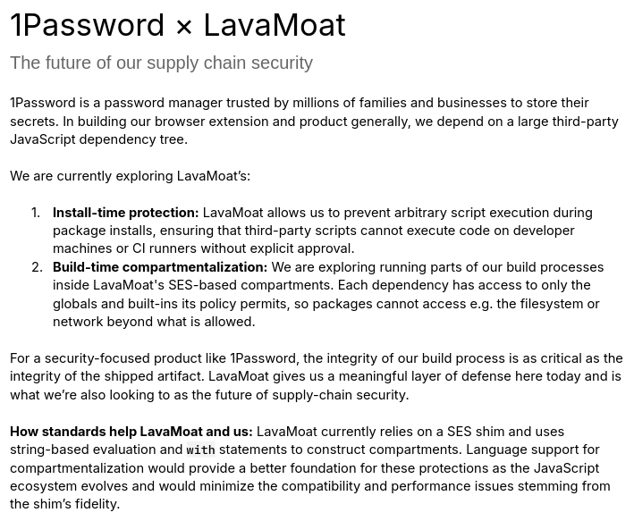

# Module Scope Ceiling

#### Stage 1 status update & feedback request

_Zbyszek Tenerowicz (ZTZ) @naugtur_

TC39 Plenary 114, 2026-05-(19-21)

---

## Motivating Cases

Updates external to this proposal:

- Severity of supply-chain security concerns
- Support from 1Password 

---



---

> How standards help LavaMoat and us: LavaMoat currently relies on a SES shim and uses string-based evaluation and `with` statements to construct compartments. Language support for compartmentalization would provide a better foundation for these protections as the JavaScript ecosystem evolves and would minimize the compatibility and performance issues stemming from the shim’s fidelity.


---
## Problem statement review

We got Stage 1 for the following problem statement:
> A way to evaluate a module and its dependencies in the context of a new global scope within the same Realm

Aiming to achieve it by severing the tie to the `GlobalEnvironmentRecord` in `ModuleEnvironmentRecord` instances by allowing setting `[[OuterEnv]]` to a different record than `module.[[Realm]].[[GlobalEnv]]`, replacing it with user-defined emulation of a global.

Feedback addressed: No multiple Globals in one Realm

---
## Scope Ceiling

[16.2.1.7.3.1 InitializeEnvironment ( )](https://tc39.es/ecma262/multipage/ecmascript-language-scripts-and-modules.html#sec-source-text-module-record-initialize-environment)

```scheme
3. Let realm be module.[[Realm]].
4. Assert: realm is not undefined.
+ if module.[[ScopeCeiling]] is not EMPTY, then
+     Let outer be NewObjectEnvironment(module.[[ScopeCeiling]], false, null)
+     Let env be NewModuleEnvironment(outer)
+   Else
      Let env be NewModuleEnvironment(realm.[[GlobalEnv]]).
5. Set module.[[Environment]] to env.
```

---

```scheme
3. Let realm be module.[[Realm]].
4. Assert: realm is not undefined.
+ if module.[[ScopeCeiling]] is not EMPTY, then
+     Let outer be NewObjectEnvironment(module.[[ScopeCeiling]], false, null)
+     Let env be NewModuleEnvironment(outer)
+   Else
      Let env be NewModuleEnvironment(realm.[[GlobalEnv]]).
5. Set module.[[Environment]] to env.
```
> note:
> - `module` is Source Text Module Record
> - NewObjectEnvironment could be called earlier
> - `[[ScopeCeiling]]` might be accessed indirectly

---

### Path to [[ScopeCeiling]]

The association between `ModuleRecord` and `ScopeCeiling` ultimately needs to be introduced by an intermediary - potentially the same intermediary that introduces `LoadedModules`. (like Compartment) 

> We initially considered associating `ScopeCeiling` with `ModuleSource` in its constructor. It doesn't compose well with the esm-phase-imports proposal anymore.

---

### Execution Context interactions


> Note: `module.[[Environment]]` becomes `LexicalEnvironment` of the `moduleContext`

```scheme
11. Set the Realm of moduleContext to module.[[Realm]].
12. Set the ScriptOrModule of moduleContext to module.
13. Set the VariableEnvironment of moduleContext to module.[[Environment]].
14. Set the LexicalEnvironment of moduleContext to module.[[Environment]].
15. Set the PrivateEnvironment of moduleContext to null.
16. Set module.[[Context]] to moduleContext.
17. Push moduleContext onto the execution context stack; 
  moduleContext is now the running execution context.
```

---

### Lookup

1. The `x` IdentifierReference is evaluated. Per [§13.1.3](https://tc39.es/ecma262/multipage/ecmascript-language-expressions.html#sec-identifiers-runtime-semantics-evaluation) (Runtime Semantics: Evaluation of IdentifierReference), calls [`ResolveBinding("x")`](https://tc39.es/ecma262/multipage/executable-code-and-execution-contexts.html#sec-resolvebinding).

2. [`ResolveBinding`](https://tc39.es/ecma262/multipage/executable-code-and-execution-contexts.html#sec-resolvebinding) reads `env` from the **running execution context's `LexicalEnvironment`**. The running execution context is `module.[[Context]]`, and its `LexicalEnvironment` is the module's `ModuleEnvironmentRecord`. Since module code is always strict, `strict` = **true**. Calls `GetIdentifierReference(moduleEnv, "x", true)`.

---

### Lookup

3. [`GetIdentifierReference`](https://tc39.es/ecma262/multipage/executable-code-and-execution-contexts.html#sec-getidentifierreference) calls **`moduleEnv.HasBinding("x")`** on the `ModuleEnvironmentRecord`. The module environment holds only the module's own top-level `var`/`let`/`const`/`class` declarations and imported bindings. `x` is none of these, so `HasBinding` returns **false**.

4. `GetIdentifierReference` reads `outer` = **`moduleEnv.[[OuterEnv]]`** reaching `ScopeCeiling`

5. `ScopeCeiling.[[OuterEnv]]` is null, so it cannot progress to Realm global for lookup

---

The change would result in an option to run a module in a context that does not have the means to reach globals lexically. 
The *undeniables* would come from the shared Realm, convenience of accessing intrinsics lexically via their global name
would depend on the provider of `ScopeCeiling` adding them.

---

## Open questions

1. Is `NewModuleEnvironment` a spec fiction? Can we verify that `ModuleEnvironmentRecord` points to its `OuterEnv` explicitly as opposed to it being looked up by default in the end?

  - This [area in Firefox](https://searchfox.org/firefox-main/source/js/src/builtin/ModuleObject.cpp#1598) seems related and [this line](https://searchfox.org/firefox-main/source/js/src/vm/EnvironmentObject.cpp#408) looks like a match for spec setting `OuterEnv`
  - This [line in V8](https://github.com/v8/v8/blob/main/src/heap/factory.cc#L1709) mentions `outer` in the context of `ModuleContext` - might be related 

 ---

## Open questions

2. `ScopeCeiling` needs means to be associated with a module. 

- We are open to exploring exposing it independently of Compartment, as some of the motivating usec-ases (e.g. DSLs) do not require an importHook to also be present.
  - Is `import('specifier', { scope: {} })` an option?
  - An entity encapsulating a pair: `ModuleSource`, `ScopeCeiling` and also be acceptable as input whereever ModuleSource is?
  - Open to fedback and suggestions.

- Regardless, the Compartment proposal would define a common `ScopeCeiling` for all modules loaded in a `Compartment`

- If we don't find a useful way to surface `ScopeCeiling` on its own, we will fold this proposal into refreshed Compartment proposal.  


---

## Thank you


<!-- visual customizations -->

<style>
/* justify, unless it's just one line (first===last) */
p {
  text-align: justify;
  text-align-last: center;
}
blockquote {
  border-left: 4px solid #888;
  padding-left: 1em;
  quotes: none;
  text-align: justify;
}
blockquote * {
  text-align: justify;
  text-align-last: left;
}
blockquote::before,
blockquote::after {
  content: none;
}
</style>
